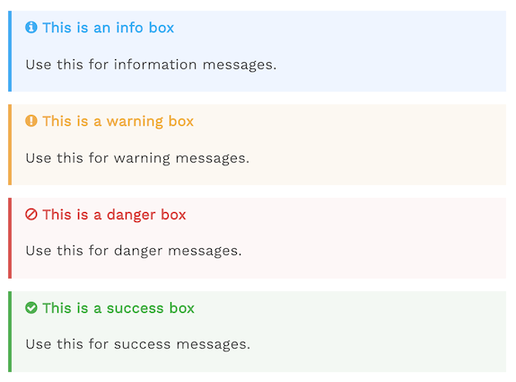

# gitbook-plugin-alerts
Info, warning, danger, success blockquotes for your gitbook.



## Installation
Add the plugin to your book.json

```json
{
    "plugins": ["alerts"]
}
```

## Usage
Info styling
```
> **[info] For info**
>
> Use this for infomation messages.
```

Warning styling
```
> **[warning] For warning**
>
> Use this for warning messages.
```

Danger styling
```
> **[danger] For danger**
>
> Use this for danger messages.
```

Success styling
```
> **[success] For info**
>
> Use this for success messages.
```

## Support

## Possible contributions
